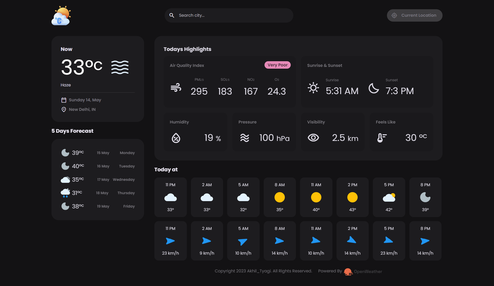
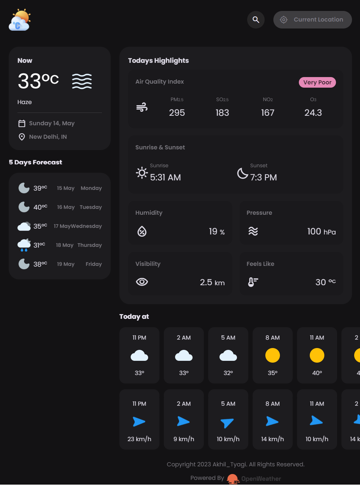
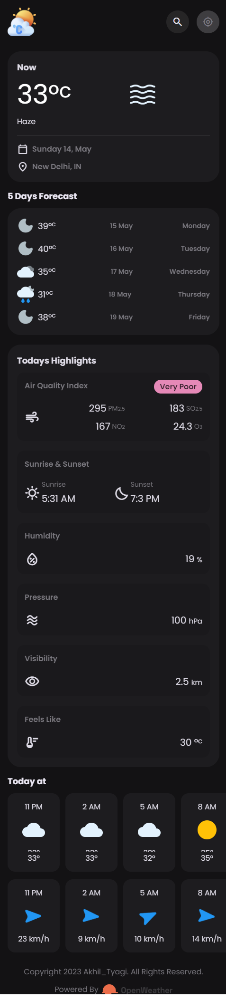

# Weather App
This is a simple Weather App built with JavaScript that retrieves current weather information using the [OpenWeather API](https://openweathermap.org/api).

## Features
 - Search for weather information for any location by entering its name
 - View current weather information such as temperature, humidity, wind speed, and weather conditions
 - View a 5-day weather forecast for the selected location
  
## Technologies Used
 - HTML
 - CSS
 - JavaScript
 - OpenWeather API

## Getting Started
To get started with the app, you'll need to:

 - Clone this repository to your local machine
 - Obtain an API key from [OpenWeather](https://openweathermap.org/api) and add it to the [api.js](./src/js/api.js) file
 - Open [index.html](./src/index.html) in your web browser

## Screenshots
### Desktop view

### Tablet view

### Mobile view

